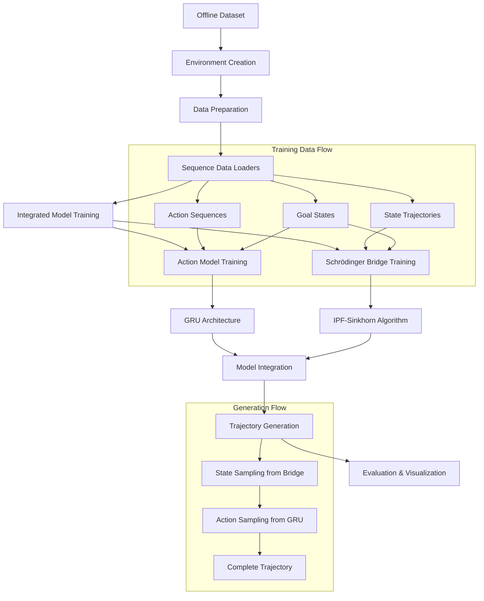

# Detailed Pipeline Documentation: Offline Goal-Conditioned RL with KL Divergence Decomposition

## Table of Contents
1. [Overview](#overview)
2. [Mathematical Foundation](#mathematical-foundation)
3. [Pipeline Architecture](#pipeline-architecture)
4. [Component Details](#component-details)
5. [Training Process](#training-process)
6. [Sampling and Generation](#sampling-and-generation)
7. [Evaluation and Visualization](#evaluation-and-visualization)
8. [Code Structure](#code-structure)
9. [Configuration Parameters](#configuration-parameters)
10. [Usage Examples](#usage-examples)

---

## Overview

This implementation presents a sophisticated offline goal-conditioned reinforcement learning algorithm that decomposes the joint trajectory distribution into two manageable components using KL divergence decomposition. The algorithm separates state trajectory learning from action sequence learning, enabling more effective learning from offline data.

### Key Innovation
The algorithm leverages the fundamental KL divergence decomposition:

```
KL(q(s₀:T, a₀:T₋₁) || p(s₀:T, a₀:T₋₁)) = 
    KL(q(s₀:T) || p(s₀:T)) + 
    E_q(s₀:T)[KL(q(a₀:T₋₁|s₀:T) || p(a₀:T₋₁|s₀:T))]
```

This decomposition allows us to:
- Learn optimal state trajectories using Schrödinger Bridge with IPF-Sinkhorn algorithm
- Learn action sequences given state trajectories using autoregressive GRU
- Generate complete trajectories by combining both components

---

## Mathematical Foundation

### 1. Problem Formulation

**Goal-Conditioned MDP:**
- State space: S ⊆ ℝ²
- Action space: A = {0, 1, 2, 3, 4} (UP, DOWN, LEFT, RIGHT, STAY)
- Goal space: G ⊆ ℝ²
- Policy: π(a|s, g) where g is the goal

**Offline Setting:**
- Dataset D = {(s₀:T, a₀:T₋₁, g)ᵢ}ᵢ₌₁ᴺ
- No environment interaction during training
- Learn from pre-collected trajectories

### 2. KL Divergence Decomposition

The joint distribution over state-action trajectories is decomposed as:

```
q(s₀:T, a₀:T₋₁) = q(s₀:T) · q(a₀:T₋₁|s₀:T)
```

Where:
- **q(s₀:T)**: State trajectory distribution (learned via Schrödinger Bridge)
- **q(a₀:T₋₁|s₀:T)**: Action sequence distribution given states (learned via GRU)

### 3. Schrödinger Bridge Formulation

**Objective:** Find optimal transport between initial and goal distributions

```
min_P ∫ P(s₀:T) log(P(s₀:T)/P₀(s₀:T)) ds₀:T
```

Subject to:
- Marginal constraints: ∫ P(s₀:T) ds₁:T = p₀(s₀)
- Goal constraints: ∫ P(s₀:T) ds₀:T₋₁ = pT(sT)

**IPF-Sinkhorn Algorithm:**
1. Initialize transition matrices P⁽⁰⁾
2. Forward scaling: Pₜ⁽ᵏ⁺¹⁾ ← Pₜ⁽ᵏ⁾ · uₜ
3. Backward scaling: Pₜ⁽ᵏ⁺¹⁾ ← vₜ · Pₜ⁽ᵏ⁺¹⁾
4. Repeat until convergence

---

## Pipeline Architecture



---

## Component Details

### 1. Environment (`toy_env.py`)

**Toy2DNavigationEnv:**
- **State Space:** Continuous 2D positions [x, y] ∈ [0, grid_size]²
- **Action Space:** 5 discrete actions {UP, DOWN, LEFT, RIGHT, STAY}
- **Goal Space:** Continuous 2D target positions [gx, gy] ∈ [0, grid_size]²

**Key Features:**
- Action noise: Gaussian noise added to movements for realism
- Goal tolerance: Distance threshold for success determination
- Continuous physics: Smooth state transitions, not grid-locked

```python
# Action mapping with noise
movement = action_map[action] + noise
new_state = current_state + movement
```

### 2. Data Generation (`trajectory_generator.py`)

**TrajectoryGenerator:**
- Creates offline dataset with diverse trajectories
- Supports different policies (random, expert, mixed)
- Configurable goal and start state sampling
- Automatic success/failure labeling

**Expert Policy Implementation:**
```python
def expert_policy(obs, goal):
    direction = goal - obs
    if np.linalg.norm(direction) < tolerance:
        return STAY
    else:
        return action_based_on_direction(direction)
```

### 3. Action Reconstruction Model (`action_reconstruction_model.py`)

**Architecture:**
- **Input:** State sequence [T+1, 2] + Goal [2]
- **Hidden:** GRU with configurable hidden dimensions
- **Output:** Action logits [T, 5] for each timestep

**Key Components:**
```python
class ActionReconstructionModel(nn.Module):
    def __init__(self, config):
        self.gru = nn.GRU(input_size, hidden_dim, num_layers)
        self.action_head = nn.Linear(hidden_dim, action_dim)
    
    def forward(self, states, goals):
        # Concatenate states and goals
        inputs = torch.cat([states, goals], dim=-1)
        
        # GRU processing
        gru_output, _ = self.gru(inputs)
        
        # Action prediction
        logits = self.action_head(gru_output[:, :-1])  # Exclude last state
        return logits
```

**Training Process:**
- Supervised learning on offline action sequences
- Cross-entropy loss: L = -∑ log p(aₜ|s₀:t+1, g)
- Teacher forcing during training
- Dropout regularization for generalization

### 4. Schrödinger Bridge (`schrodinger_bridge.py`)

**StateDiscretizer:**
- Maps continuous states to discrete grid cells
- Uniform grid discretization: idx = floor(state * grid_size / max_value)
- Handles boundary conditions and out-of-bounds states

**IPF-Sinkhorn Algorithm:**
```python
def solve_bridge(self, trajectories, goals):
    # Extract marginals from data
    p_0, p_T = self.extract_marginals_from_data(trajectories, goals)
    
    # Initialize with empirical transitions
    P = self.compute_empirical_transitions(trajectories)
    
    # IPF iterations
    for iteration in range(max_iterations):
        # Forward pass: match initial marginal
        for t in range(T):
            P[t] = self.normalize_rows(P[t], p_0)
        
        # Backward pass: match goal marginal  
        for t in range(T-1, -1, -1):
            P[t] = self.normalize_cols(P[t], p_T)
        
        # Check convergence
        if self.check_convergence(P):
            break
    
    return P
```

**Sampling Process:**
```python
def sample_trajectory(self, initial_state, goal_state):
    # Start from initial distribution or specific state
    current_idx = self.discretize(initial_state)
    trajectory = [current_idx]
    
    # Sample through transition matrices
    for t in range(T):
        probs = self.transition_matrices[t][current_idx]
        next_idx = np.random.choice(num_states, p=probs)
        trajectory.append(next_idx)
        current_idx = next_idx
    
    # Convert back to continuous space
    return self.continuous_trajectory(trajectory)
```

### 5. Integrated Model (`integrated_model.py`)

**IntegratedOfflineRLModel:**
- Combines action model and Schrödinger Bridge
- Manages training coordination
- Handles trajectory generation pipeline

**Training Coordination:**
```python
def train(self, train_loader, val_loader):
    # 1. Prepare data for both components
    trajectories, goals = self.prepare_training_data(train_loader)
    
    # 2. Train action model (supervised learning)
    action_losses = self.train_action_model(train_loader, val_loader)
    
    # 3. Train Schrödinger Bridge (IPF-Sinkhorn)
    bridge_matrices = self.train_schrodinger_bridge(trajectories, goals)
    
    # 4. Mark as trained
    self.is_trained = True
    
    return training_info
```

---

## Training Process

### Phase 1: Data Preparation

1. **Environment Setup:**
   ```python
   env = make_toy_env(
       grid_size=10,
       max_steps=50,
       goal_conditioned=True,
       action_noise=0.1
   )
   ```

2. **Dataset Generation:**
   ```python
   expert_trajectories = create_expert_dataset(
       env=env,
       num_trajectories=1000,
       noise=0.2
   )
   ```

3. **Data Loading:**
   ```python
   train_loader, val_loader = create_sequence_data_loaders(
       trajectories=expert_trajectories,
       batch_size=32,
       max_length=50
   )
   ```

### Phase 2: Action Model Training

**Training Loop:**
```python
for epoch in range(num_epochs):
    for batch in train_loader:
        # Forward pass
        logits = model(batch.states, batch.goals)
        
        # Compute loss
        loss = F.cross_entropy(logits.view(-1, 5), batch.actions.view(-1))
        
        # Backward pass
        optimizer.zero_grad()
        loss.backward()
        optimizer.step()
```

**Key Features:**
- Autoregressive training: predict aₜ given s₀:t+1, g
- Teacher forcing: use ground truth states
- Gradient clipping for stability
- Learning rate scheduling

### Phase 3: Schrödinger Bridge Training

**Data Processing:**
```python
# Extract state trajectories from sequence data
state_trajectories = []
goal_states = []

for batch in dataloader:
    for i in range(batch_size):
        traj = batch.states[i, :length]  # Remove padding
        goal = batch.goals[i]
        
        state_trajectories.append(traj)
        goal_states.append(goal)
```

**Bridge Optimization:**
```python
# IPF-Sinkhorn iterations
P_bridge = solve_bridge(state_trajectories, goal_states)
```

---

## Sampling and Generation

### 1. State Trajectory Sampling

**From Schrödinger Bridge:**
```python
def sample_state_trajectory(self, initial_state, goal_state):
    # Option 1: Specific initial state
    if initial_state is not None:
        current_idx = self.discretizer.discretize_state(initial_state)
    else:
        # Sample from initial distribution
        current_idx = np.random.choice(num_states, p=p_0)
    
    # Forward sampling through bridge
    trajectory_indices = [current_idx]
    for t in range(T):
        transition_probs = self.transition_matrices[t][current_idx]
        next_idx = np.random.choice(num_states, p=transition_probs)
        trajectory_indices.append(next_idx)
        current_idx = next_idx
    
    # Convert to continuous coordinates
    continuous_trajectory = [
        self.discretizer.continuous_state(idx) 
        for idx in trajectory_indices
    ]
    
    return np.array(continuous_trajectory)
```

### 2. Action Sequence Sampling

**From GRU Model:**
```python
def sample_actions(self, states, goals, temperature=1.0):
    with torch.no_grad():
        # Forward pass through GRU
        logits = self.forward(states, goals)
        
        # Temperature scaling
        scaled_logits = logits / temperature
        
        # Sampling
        probs = F.softmax(scaled_logits, dim=-1)
        actions = torch.multinomial(probs.view(-1, 5), 1)
        
        return actions.view(batch_size, sequence_length)
```

### 3. Complete Trajectory Generation

**Integration Process:**
```python
def generate_trajectory(self, initial_state, goal_state, temperature):
    # Step 1: Sample state trajectory from bridge
    state_trajectory = self.schrodinger_bridge.sample_trajectory(
        initial_state=initial_state,
        goal_state=goal_state
    )
    
    # Step 2: Prepare inputs for action model
    states_tensor = torch.tensor(state_trajectory, dtype=torch.float32)
    goal_tensor = torch.tensor(goal_state, dtype=torch.float32)
    goal_tensor = goal_tensor.expand(len(state_trajectory), -1)
    
    # Step 3: Sample actions from GRU
    actions = self.action_model.sample_actions(
        states_tensor.unsqueeze(0),  # Add batch dimension
        goal_tensor.unsqueeze(0),
        temperature=temperature
    )
    
    # Step 4: Create trajectory object
    trajectory = Trajectory(
        observations=state_trajectory.tolist(),
        actions=actions.squeeze(0).tolist(),
        goals=[goal_state] * len(state_trajectory),
        success=self.evaluate_success(state_trajectory[-1], goal_state)
    )
    
    return trajectory
```

### 4. Batch Generation

**Multiple Trajectories:**
```python
def generate_trajectories(self, num_trajectories, initial_states, goal_states):
    trajectories = []
    
    for i in range(num_trajectories):
        # Handle optional initial/goal states
        init_state = initial_states[i] if initial_states else None
        goal_state = goal_states[i] if goal_states else None
        
        # Generate single trajectory
        traj = self.generate_trajectory(init_state, goal_state)
        trajectories.append(traj)
    
    return trajectories
```

---

## Evaluation and Visualization

### 1. Trajectory Evaluation

**Metrics Computed:**
```python
def evaluate_trajectories(self, trajectories, goal_tolerance=0.5):
    metrics = {
        'success_rate': 0.0,
        'avg_length': 0.0,
        'avg_goal_distance': 0.0,
        'path_efficiency': 0.0
    }
    
    for traj in trajectories:
        final_state = np.array(traj.observations[-1])
        goal = np.array(traj.goals[0])
        
        # Goal achievement
        distance = np.linalg.norm(final_state - goal)
        if distance <= goal_tolerance:
            metrics['success_rate'] += 1.0
        
        # Path analysis
        metrics['avg_length'] += len(traj.observations)
        metrics['avg_goal_distance'] += distance
        
        # Efficiency calculation
        start_state = np.array(traj.observations[0])
        straight_line = np.linalg.norm(final_state - start_state)
        path_length = sum(
            np.linalg.norm(np.array(traj.observations[i+1]) - np.array(traj.observations[i]))
            for i in range(len(traj.observations) - 1)
        )
        efficiency = straight_line / path_length if path_length > 0 else 0
        metrics['path_efficiency'] += efficiency
    
    # Normalize by number of trajectories
    for key in metrics:
        metrics[key] /= len(trajectories)
    
    return metrics
```

### 2. Visualization System

**Individual Trajectory Inspection:**
```python
def inspect_trajectory(trajectory, traj_index):
    # Extract data
    states = np.array(trajectory.observations)
    actions = trajectory.actions
    goals = np.array(trajectory.goals[0])
    
    # Basic information
    print(f"Trajectory #{traj_index}")
    print(f"Length: {len(states)} states")
    print(f"Success: {trajectory.success}")
    
    # Distance analysis
    start_distance = np.linalg.norm(states[0] - goals)
    end_distance = np.linalg.norm(states[-1] - goals)
    print(f"Distance improvement: {start_distance - end_distance:.3f}")
    
    # Action breakdown
    action_counts = {}
    action_names = {0: "UP", 1: "DOWN", 2: "LEFT", 3: "RIGHT", 4: "STAY"}
    for action in actions:
        name = action_names[action]
        action_counts[name] = action_counts.get(name, 0) + 1
    
    print("Action distribution:", action_counts)
    
    # Step-by-step walkthrough
    print("\nStep-by-step trajectory:")
    for i, state in enumerate(states):
        print(f"  Step {i}: ({state[0]:.2f}, {state[1]:.2f})", end="")
        if i < len(actions):
            action_name = action_names[actions[i]]
            print(f" --{action_name}-->")
        else:
            print(" [FINAL]")
```

**Dual Plot Visualization:**
```python
def visualize_single_trajectory(trajectory, traj_index):
    states = np.array(trajectory.observations)
    goals = np.array(trajectory.goals[0])
    
    fig, (ax1, ax2) = plt.subplots(1, 2, figsize=(16, 6))
    
    # Left plot: Trajectory path
    ax1.plot(states[:, 0], states[:, 1], 'b-', linewidth=3, alpha=0.7)
    ax1.scatter(states[0, 0], states[0, 1], c='green', s=200, marker='o', 
                label='Start', zorder=5)
    ax1.scatter(states[-1, 0], states[-1, 1], c='red', s=200, marker='s', 
                label='End', zorder=5)
    ax1.scatter(goals[0], goals[1], c='orange', s=300, marker='*', 
                label='Goal', zorder=5)
    
    # Add step annotations
    for i in range(0, len(states), max(1, len(states)//10)):
        ax1.annotate(f'{i}', (states[i, 0], states[i, 1]), 
                    xytext=(5, 5), textcoords='offset points')
    
    ax1.set_title(f'Trajectory #{traj_index} - Path Visualization')
    ax1.legend()
    ax1.grid(True, alpha=0.3)
    
    # Right plot: Distance to goal over time
    distances = [np.linalg.norm(state - goals) for state in states]
    steps = list(range(len(distances)))
    
    ax2.plot(steps, distances, 'r-', linewidth=2, marker='o', markersize=4)
    ax2.axhline(y=0.5, color='orange', linestyle='--', alpha=0.7, 
                label='Goal Tolerance')
    ax2.fill_between(steps, 0, 0.5, alpha=0.2, color='green', 
                     label='Success Zone')
    
    ax2.set_xlabel('Step')
    ax2.set_ylabel('Distance to Goal')
    ax2.set_title('Progress Tracking')
    ax2.legend()
    ax2.grid(True, alpha=0.3)
    
    plt.tight_layout()
    plt.show()
```

### 3. Comparative Analysis

**Multi-Dataset Comparison:**
```python
def compare_trajectory_sets(expert_trajs, generated_trajs, specific_trajs):
    datasets = {
        'Expert': expert_trajs,
        'Generated Random': generated_trajs,
        'Generated Specific': specific_trajs
    }
    
    comparison = {}
    for name, trajs in datasets.items():
        metrics = evaluate_trajectories(trajs)
        comparison[name] = metrics
    
    # Display comparison table
    print("Trajectory Set Comparison:")
    print("-" * 60)
    for name, metrics in comparison.items():
        print(f"{name}:")
        print(f"  Success Rate: {metrics['success_rate']:.1%}")
        print(f"  Avg Length: {metrics['avg_length']:.1f}")
        print(f"  Avg Distance: {metrics['avg_goal_distance']:.3f}")
        print(f"  Path Efficiency: {metrics['path_efficiency']:.3f}")
```

---

## Code Structure

### Directory Organization
```
ogrl_sb/
├── toy_env.py                    # Environment implementation
├── trajectory_generator.py       # Data generation utilities
├── data_loader.py                # Standard batch data loading
├── sequence_data_loader.py       # Sequence-specific data loading
├── action_reconstruction_model.py # GRU-based action model
├── schrodinger_bridge.py         # IPF-Sinkhorn implementation
├── integrated_model.py           # Main integration class
├── ogrl_toy_expt_algorithm.ipynb # Complete pipeline notebook
├── detailed_pipeline.md          # This documentation
└── requirements.txt               # Dependencies
```

### Key Classes and Their Responsibilities

1. **`Toy2DNavigationEnv`**: Environment dynamics and physics
2. **`TrajectoryGenerator`**: Offline data collection with various policies
3. **`SequenceDataLoader`**: Batching and padding for sequence data
4. **`ActionReconstructionModel`**: GRU architecture for action prediction
5. **`SchrodingerBridge`**: IPF-Sinkhorn algorithm implementation
6. **`IntegratedOfflineRLModel`**: Main orchestration and generation

### Data Flow Architecture

```
Offline Data → SequenceDataLoader → Training Split
                     ↓
              Action Model Training ←→ Validation
                     ↓
              Bridge Training (IPF-Sinkhorn)
                     ↓
              Integrated Model (Ready for Generation)
                     ↓
              State Sampling → Action Sampling → Complete Trajectory
```

---

## Configuration Parameters

### Environment Configuration
```python
env_config = {
    'grid_size': 10,          # Environment size [0, grid_size]²
    'max_steps': 50,          # Maximum episode length
    'goal_tolerance': 0.5,    # Success distance threshold
    'action_noise': 0.1       # Gaussian noise std for actions
}
```

### Model Configuration
```python
model_config = IntegratedModelConfig(
    # Action Model
    action_state_dim=2,         # State dimensionality
    action_goal_dim=2,          # Goal dimensionality  
    action_action_dim=5,        # Number of discrete actions
    action_hidden_dim=128,      # GRU hidden size
    action_num_layers=2,        # Number of GRU layers
    action_dropout=0.1,         # Dropout probability
    
    # Schrödinger Bridge  
    bridge_grid_size=20,        # Discretization resolution
    bridge_max_iterations=50,   # IPF iterations
    bridge_sinkhorn_iterations=20,  # Sinkhorn steps per IPF
    bridge_convergence_threshold=1e-4,  # Convergence criteria
    bridge_regularization=0.01, # Entropy regularization
    
    # Training
    learning_rate=1e-3,         # Adam learning rate
    num_epochs=100,             # Training epochs
    batch_size=64,              # Batch size
    device='cpu'                # Compute device
)
```

### Data Generation Configuration
```python
data_config = {
    'num_trajectories': 1000,   # Dataset size
    'train_ratio': 0.8,         # Train/validation split
    'batch_size': 32,           # Sequence batch size
    'max_length': 50,           # Maximum sequence length
    'min_length': 5,            # Minimum sequence length
    'noise': 0.2                # Expert policy noise
}
```

---

## Usage Examples

### Complete Training Pipeline
```python
# 1. Environment and data preparation
env = make_toy_env(grid_size=10, max_steps=50, action_noise=0.1)
expert_trajectories = create_expert_dataset(env, num_trajectories=1000)
train_loader, val_loader = create_sequence_data_loaders(expert_trajectories)

# 2. Model creation and training
config = IntegratedModelConfig()
model = IntegratedOfflineRLModel(config)
training_info = model.train(train_loader, val_loader)

# 3. Trajectory generation
trajectories = model.generate_trajectories(
    num_trajectories=20,
    temperature=1.0
)

# 4. Evaluation
metrics = model.evaluate_trajectories(trajectories, goal_tolerance=0.5)
print(f"Success rate: {metrics['success_rate']:.1%}")
```

### Custom Trajectory Generation
```python
# Specific initial states and goals
initial_states = [np.array([1.0, 1.0]), np.array([2.0, 2.0])]
goal_states = [np.array([8.0, 8.0]), np.array([7.0, 7.0])]

specific_trajectories = model.generate_trajectories(
    num_trajectories=2,
    initial_states=initial_states,
    goal_states=goal_states,
    temperature=0.8  # More deterministic
)

# Visualize results
model.visualize_generation(
    num_samples=2,
    initial_states=initial_states,
    goal_states=goal_states
)
```

### Individual Trajectory Analysis
```python
# Select any trajectory for detailed inspection
trajectory_index = 0
trajectory = specific_trajectories[trajectory_index]

# Detailed analysis
inspect_trajectory(trajectory, trajectory_index)

# Visual analysis  
visualize_single_trajectory(trajectory, trajectory_index)
```

### Batch Evaluation and Comparison
```python
# Evaluate different trajectory sets
expert_metrics = model.evaluate_trajectories(expert_trajectories)
generated_metrics = model.evaluate_trajectories(generated_trajectories)

# Compare performance
print("Performance Comparison:")
print(f"Expert success rate: {expert_metrics['success_rate']:.1%}")
print(f"Generated success rate: {generated_metrics['success_rate']:.1%}")
print(f"Expert avg length: {expert_metrics['avg_length']:.1f}")
print(f"Generated avg length: {generated_metrics['avg_length']:.1f}")
```

---

## Key Advantages and Design Decisions

### 1. Theoretical Foundation
- **Rigorous decomposition**: Based on proven KL divergence mathematics
- **Optimal transport**: Schrödinger Bridge ensures optimal state transitions
- **Principled separation**: Clear division between state and action learning

### 2. Practical Benefits
- **Modular design**: Components can be trained and improved independently
- **Continuous state space**: More realistic than discrete grid worlds
- **Goal conditioning**: Native support for diverse goals
- **Temperature control**: Adjustable exploration during generation

### 3. Scalability Features
- **Configurable complexity**: Easy to adjust model capacity
- **Efficient sampling**: Fast trajectory generation after training
- **Extensible architecture**: Can accommodate additional components

### 4. Interpretability
- **Clear separation**: State vs action learning is transparent
- **Visual analysis**: Comprehensive visualization tools
- **Detailed metrics**: Multiple evaluation dimensions

This implementation provides a complete, well-documented pipeline for offline goal-conditioned RL using advanced mathematical techniques in a practical, extensible framework.